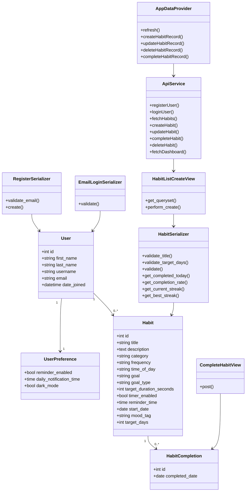

# Class Diagram

## Explanation

This diagram focuses on the real backend models and the main frontend data layer. The backend stores users, preferences, habits, and habit completions. The serializers validate and shape API data. The frontend uses `AppDataProvider` and `api.js` service functions instead of calling the backend directly from every page. There is no backend `TimerSession` model yet; timed habit countdown state is currently stored in frontend local storage.
