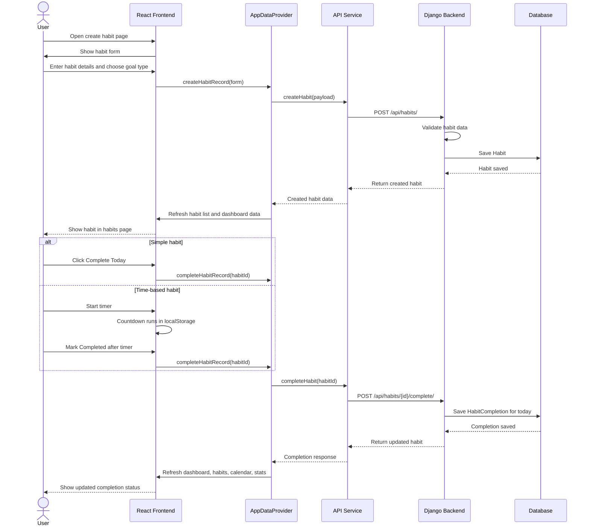

# Sequence Diagram

## Explanation

This sequence shows the create-and-complete flow. The React form sends habit data through the shared context and API service. Django validates and saves the habit. Completion uses the same backend endpoint for simple and time-based habits. The timer itself is frontend state, but the final completion is saved in the database.
