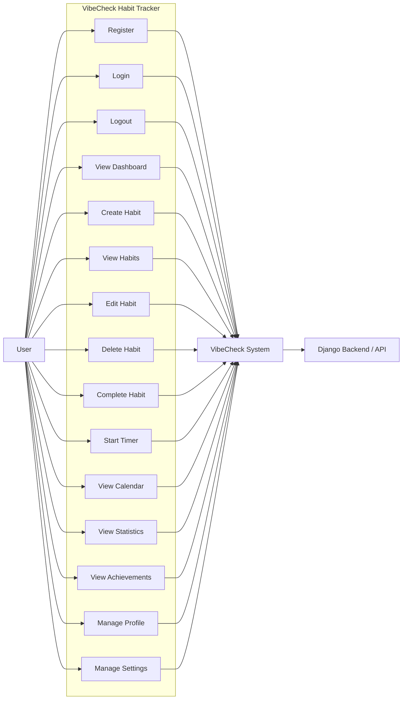

# Use Case Diagram

## Explanation

The main actor is the user. The user can register, log in, manage habits, complete habits, use the timer for time-based habits, and view progress pages. The React frontend communicates with the Django backend/API for saved user, habit, completion, profile, and settings data. The timer runs in the frontend and uses the normal completion endpoint when the user marks the habit complete.
